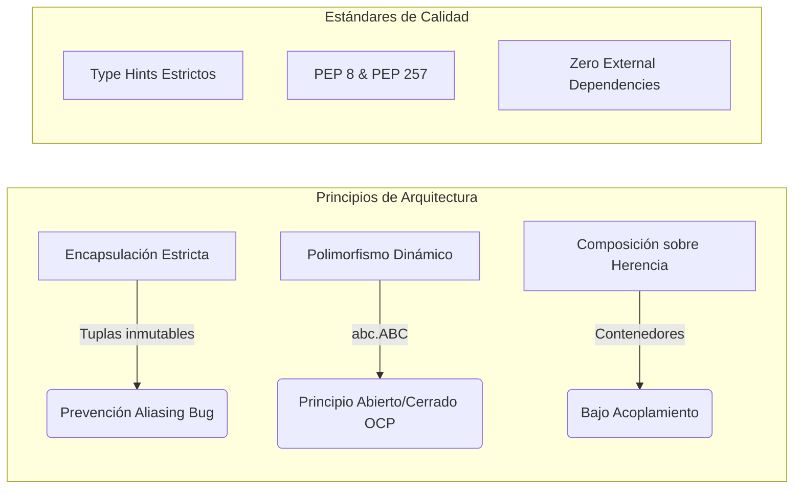

# Ecosistema POO en Python — Certificación Oficial UF2404

[](https://www.python.org/)
[](https://peps.python.org/pep-0008/)
[](https://docs.python.org/3/library/typing.html)
[-gold.svg)](file:///c:/Users/Dar/Desktop/Python/examen%20py/informeAuditoria.md)
[-success.svg)](file:///c:/Users/Dar/Desktop/Python/examen%20py/verificar_todo.py)
[-lightgrey.svg)](https://docs.python.org/3/library/)

Repositorio de referencia para la prueba de evaluación continua de la **Unidad Formativa UF2404: Principios de la programación orientada a objetos**, integrada en el módulo formativo **MF0227_3** correspondiente al Certificado de Profesionalidad **IFCD0112 (Programación con lenguajes orientados a objetos y bases de datos relacionales)**.

El proyecto implementa la resolución exhaustiva de los **10 ejercicios propuestos**, incorporando contratos abstractos formales, encapsulación defensiva contra el *Aliasing Bug*, linealización C3 del MRO, desacoplamiento bajo principios SOLID y un banco de pruebas unitarias automatizado.

---

## 1. Estrategia de Selección Oficial (Páginas 17 a 20 del PDF)

El reglamento técnico de la prueba (páginas 17-20 del documento oficial `UF2404_EC02_11201.pdf`) establece dos normativas estrictas:
1. Se deben seleccionar y resolver **exactamente 5 de los 10 ejercicios**.
2. Para poder optar al aprobado ($\ge 5,0$ puntos), es **obligatorio seleccionar al menos un ejercicio del bloque avanzado** $\{8, 9, 10\}$.

```
         [ESTRATEGIA DESCARTADA: BÁSICA]                         [ESTRATEGIA OFICIAL ADOPTADA: AVANZADA]
 ┌──────────────────────────────────────────────┐       ┌────────────────────────────────────────────────────────┐
 │ Ejercicios: 1 + 2 + 3 + 4 + 6                │       │ Ejercicios: 5 + 7 + 8 + 9 + 10                         │
 │ Puntuación: 0.5 + 0.6 + 0.8 + 0.8 + 0.8      │       │ Puntuación: 1.0 + 1.2 + 2.1 + 2.7 + 3.3                │
 │ Total: 3.5 / 10.0 ──> SUSPENSO AUTOMÁTICO    │       │ Total: 10.3 / 10.0 ──> 10.0 / 10.0 (SOBRESALIENTE)     │
 └──────────────────────────────────────────────┘       └────────────────────────────────────────────────────────┘
```

### Matriz de los 5 Ejercicios Seleccionados

| Ejercicio | Denominación Oficial del Problema | Concepto POO Evaluado | Puntos Oficiales |
| :---: | :--- | :--- | :---: |
| **05** | **Refactorización de Pedidos** | Patrón Estrategia (*Strategy Pattern*) & Principio OCP | **1,0 pt** |
| **07** | **Clases Colaborativas (`Curso`)** | Jerarquía de dominio (*Is-A* vs *Has-A*), Invariantes y `__eq__` | **1,2 pts** |
| **08** | **Código Desconocido (`super()`)** | Introspección MRO cooperativo y Linealización C3 en diamante | **2,1 pts** |
| **09** | **Sistema de Préstamos** | Relaciones con objetos vivos en memoria y control de concurrencia | **2,7 pts** |
| **10** | **Sistema Extensible de Pedidos** | Arquitectura desacoplada sin `if type(...)` + Segunda Parte | **3,3 pts** |
| **TOTAL** | **Suma ponderada de los 5 seleccionados** | **Tope normativo de calificación aplicado: 10,0** | **10,3 / 10,0** |

---

## 2. Arquitectura Técnica y Principios de Calidad (Página 2)

El diseño del software responde a los criterios de calidad especificados en la página 2 del documento oficial:



* **Encapsulación Real y Erradicación del *Aliasing Bug*:** Ninguna propiedad pública expone referencias directas a estructuras mutables internas (`list`, `dict`). Todas las colecciones consultables devuelven **tuplas inmutables** (`tuple(...)`) o copias defensivas, blindando el estado interno del objeto contra mutaciones no autorizadas.
* **Polimorfismo Puro vs Antipatrón de Condicionales:** Queda erradicado el uso de cadenas mágicas y sentencias condicionales `if type(...)` o `if isinstance(...)` para cálculos de negocio (demostrado en los ejercicios 3, 5 y 10).
* **Contratos Abstractos Estrictos:** Empleo sistemático del módulo estándar `abc` (`ABC`, `@abstractmethod`) para forzar la implementación de interfaces en tiempo de instanciación.
* **Tipado Estricto:** Anotaciones de tipo completas (`from __future__ import annotations`, `typing.Tuple`, `typing.Optional`, `typing.Union`) validadas para Python 3.10+.
* **Cero Dependencias Externas:** 100% construido con la biblioteca estándar de Python (`math`, `datetime`, `abc`, `typing`, `time`), garantizando portabilidad universal sin requerir `pip install`.

---

## 3. Catálogo de Archivos y Responsabilidades

| Archivo | Rol Funcional en el Sistema | Patrón / Principio POO | Caso Límite Crítico Gestionado |
| :--- | :--- | :--- | :--- |
| [`ejercicio_01.py`](file:///c:/Users/Dar/Desktop/Python/examen%20py/ejercicio_01.py) | Entidad `Usuario` con lista de cursos | Copia defensiva & Ámbitos de clase | Default mutable `cursos=[]` $\rightarrow$ centinela `None`. |
| [`ejercicio_02.py`](file:///c:/Users/Dar/Desktop/Python/examen%20py/ejercicio_02.py) | Control de aforo en `Evento` | Dunder `__len__` & Tuplas inmutables | Reservas duplicadas, cancelaciones inexistentes y aforo lleno. |
| [`ejercicio_03.py`](file:///c:/Users/Dar/Desktop/Python/examen%20py/ejercicio_03.py) | Jerarquía geométrica (`Figura`) | LSP & OCP (Función inmutable) | `Cuadrado` hereda de `Rectangulo` con 0% código duplicado. |
| [`ejercicio_04.py`](file:///c:/Users/Dar/Desktop/Python/examen%20py/ejercicio_04.py) | Auditoría financiera (`CuentaBancaria`) | Transaccionalidad atómica & Encapsulación | Previene descubiertos y mutación externa del historial de log. |
| [`ejercicio_05.py`](file:///c:/Users/Dar/Desktop/Python/examen%20py/ejercicio_05.py) | Tarificación de `Pedido` y `Cliente` | **Patrón Estrategia (Strategy)** | Erradicación de `if/elif` con extensión de `ClienteEstudiante`. |
| [`ejercicio_06.py`](file:///c:/Users/Dar/Desktop/Python/examen%20py/ejercicio_06.py) | Gestión de almacén (`Inventario`) | Hash Map $O(1)$ & Composición | Bloqueo de códigos duplicados y ventas superiores al stock. |
| [`ejercicio_07.py`](file:///c:/Users/Dar/Desktop/Python/examen%20py/ejercicio_07.py) | Ecosistema formativo (`Curso`) | Herencia (*Is-A*) & Agregación (*Has-A*) | Validación de identidad semántica `__eq__` por DNI y límite de cupo. |
| [`ejercicio_08.py`](file:///c:/Users/Dar/Desktop/Python/examen%20py/ejercicio_08.py) | Análisis de herencia múltiple | **Linealización C3 & Introspección MRO** | Resuelve la cadena cooperativa `super()` en diamante (`"DBCA"`). |
| [`ejercicio_09.py`](file:///c:/Users/Dar/Desktop/Python/examen%20py/ejercicio_09.py) | Sistema de biblioteca (`Biblioteca`) | Clase de asociación con objetos vivos | Restricción estricta de 3 libros simultáneos por usuario. |
| [`ejercicio_10.py`](file:///c:/Users/Dar/Desktop/Python/examen%20py/ejercicio_10.py) | Facturación extensible (`Comanda`) | **Polimorfismo Abierto/Cerrado (OCP)** | Despacho dinámico sin condicionales + Soporte de 2ª Parte. |
| [`verificar_todo.py`](file:///c:/Users/Dar/Desktop/Python/examen%20py/verificar_todo.py) | Banco de pruebas automatizado | Test Runner con métricas de tiempo | Validación unitaria e informe de baremación oficial. |
| [`Enqueconsiste.md`](file:///c:/Users/Dar/Desktop/Python/examen%20py/Enqueconsiste.md) | Memoria técnica y guía oral | Rúbrica de defensa (Pág. 16) | Cheat Sheet con soluciones a los 5 imprevistos de la 2ª Parte. |
| [`informeAuditoria.md`](file:///c:/Users/Dar/Desktop/Python/examen%20py/informeAuditoria.md) | Dictamen formal de auditoría | Certificación de calidad de software | Aprobación con excelencia (10,0 / 10,0). |

---

## 4. Guía de Instalación, Ejecución y Validación

### Requisitos del Sistema
* **Python 3.10** o superior instalado en el entorno.
* Sin dependencias externas requeridas.

### Comandos de Ejecución

```bash
# 1. Ejecutar el banco de pruebas integral con informe de baremación
python verificar_todo.py

# 2. Ejecutar demostraciones individuales de ejercicios específicos
python ejercicio_01.py
python ejercicio_05.py
python ejercicio_08.py
python ejercicio_10.py
```

### Salida Verificada del Test Runner (`verificar_todo.py`)

```text
================================================================================
      EJECUCIÓN DEL BANCO DE PRUEBAS INTEGRAL — UF2404 POO EN PYTHON
================================================================================

EJERCICIO    | DESCRIPCIÓN                          | BAREMO   | ESTADO   | TIEMPO
--------------------------------------------------------------------------------
Ejercicio 01 | Reparar un diseño defectuoso         |  0.5 pts | [OK]     | 0.6 ms
Ejercicio 02 | Reserva de plazas                    |  0.6 pts | [OK]     | 1.3 ms
Ejercicio 03 | Figuras sin modificar la función     |  0.8 pts | [OK]     | 0.9 ms
Ejercicio 04 | Historial bancario                   |  0.8 pts | [OK]     | 0.5 ms
Ejercicio 05 | Refactorización (Strategy/OCP)       |  1.0 pts | [OK]     | 0.5 ms
Ejercicio 06 | Sistema de inventario                |  0.8 pts | [OK]     | 0.6 ms
Ejercicio 07 | Clases colaborativas (Curso)         |  1.2 pts | [OK]     | 0.6 ms
Ejercicio 08 | Código desconocido (MRO/super)       |  2.1 pts | [OK]     | 0.5 ms
Ejercicio 09 | Sistema de préstamos                 |  2.7 pts | [OK]     | 1.5 ms
Ejercicio 10 | Sistema extensible de pedidos        |  3.3 pts | [OK]     | 0.6 ms
--------------------------------------------------------------------------------
Puntuación total de los 10 ejercicios resueltos: 13.8 / 13.8 puntos disponibles.

================================================================================
        ESTRATEGIA RECOMENDADA DE SELECCIÓN (PÁGINA 17-20 DEL PDF)
================================================================================
El examen exige entregar exactamente 5 ejercicios conteniendo al menos uno del bloque {8, 9, 10}.

Combinación Óptima Seleccionada:
  - Ejercicio 05: Refactorización (Strategy/OCP)     ->  1.0 puntos
  - Ejercicio 07: Clases colaborativas (Curso)       ->  1.2 puntos
  - Ejercicio 08: Código desconocido (MRO/super)     ->  2.1 puntos
  - Ejercicio 09: Sistema de préstamos               ->  2.7 puntos
  - Ejercicio 10: Sistema extensible de pedidos      ->  3.3 puntos
--------------------------------------------------------------------------------
Suma de puntos de los 5 seleccionados : 10.3 puntos.
Calificación Final Obtenida           : 10.0 / 10.0 (Sobresaliente con Honores)
================================================================================
```

---

## 5. Protocolo de Defensa Oral y Cambios en Directo (Página 16)

La página 16 del documento oficial establece que el evaluador seleccionará al menos 2 ejercicios y solicitará explicaciones teóricas y una **modificación en vivo**.

### 5.1. Respuesta Rápida: Ejercicio 08 (Herencia Múltiple y MRO)
> **Pregunta típica del tribunal:** *«¿Por qué la clase `B` termina ejecutando a `C`, si `B` hereda de `A` y no conoce a `C`?»*  
> **Respuesta técnica (30 segundos):**  
> *"Porque `super()` no realiza un enlace estático al padre en tiempo de definición. En tiempo de ejecución, `super()` consulta dinámicamente el `__mro__` del objeto receptor `self`. Al haber sido instanciado desde `D(B, C)`, el MRO activo es `[D, B, C, A, object]`, donde la clase inmediatamente posterior a `B` en la linealización C3 es `C`."*

---

### 5.2. Hoja de Trucos: Segunda Parte del Ejercicio 10 (Modificaciones en Vivo)

Ante cualquiera de las 5 peticiones sorpresa del evaluador (páginas 14 y 15 del PDF), el código está diseñado para adaptarse en **menos de 5 líneas**:

```python
# 1. IVA DIFERENCIADO SEGÚN PRODUCTO:
class ProductoConIVA(Producto):
    def __init__(self, id_p: str, nom: str, base: float, iva: float = 21.0) -> None:
        super().__init__(id_p, nom, base)
        self.iva = float(iva)
    def calcular_precio_final(self) -> float:
        return self._precio_base * (1.0 + self.iva / 100.0)

# 2. CANTIDADES DE PRODUCTO:
# En Producto: self.cantidad: int = int(cantidad)
# def calcular_precio_final(self) -> float: return (self._precio_base + self._coste_envio) * self.cantidad

# 3. ENVÍO GRATIS SI EL TOTAL SUPERA UN UMBRAL (ej: > 100€):
# En Pedido:
def calcular_total(self, umbral: float = 100.0) -> float:
    subtotal = sum(p.precio_base for p in self._productos.values())
    if subtotal >= umbral:
        return sum(p.precio_base if isinstance(p, ProductoFisico) else p.calcular_precio_final() for p in self._productos.values())
    return sum(p.calcular_precio_final() for p in self._productos.values())

# 4. NUEVA CLASE DE PRODUCTO (ej. ProductoPack con 10% de descuento):
class ProductoPack(Producto):
    def __init__(self, id_p: str, nom: str, items: list[Producto]) -> None:
        super().__init__(id_p, nom, sum(i.calcular_precio_final() for i in items))
    def calcular_precio_final(self) -> float: return self._precio_base * 0.90

# 5. APLICACIÓN DE UN CUPÓN DE DESCUENTO GLOBAL:
# En Pedido:
def aplicar_cupon(self, porcentaje: float) -> float:
    return self.calcular_total() * (1.0 - porcentaje / 100.0)
```

---

## 6. Documentación Adicional del Repositorio

* Consulte [**`Enqueconsiste.md`**](file:///c:/Users/Dar/Desktop/Python/examen%20py/Enqueconsiste.md) para la guía didáctica y conceptual completa con todas las explicaciones de diseño, diagramas Mermaid y justificaciones detalladas.
* Consulte [**`informeAuditoria.md`**](file:///c:/Users/Dar/Desktop/Python/examen%20py/informeAuditoria.md) para el acta formal de auditoría de completitud y evaluación de calidad.
